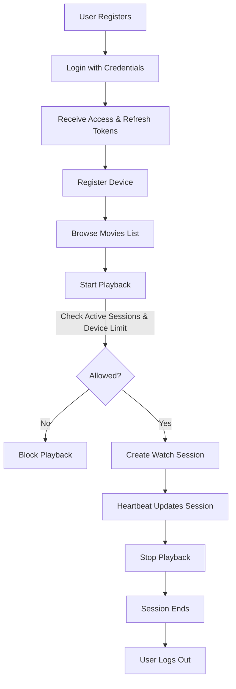

# 🎬 Netflix Backend

A simplified Netflix-like backend built with Django REST Framework, featuring **JWT authentication**, **device management**, **movie catalog**, and **streaming session limits**.

Base URL:

```
https://netflix-backend-lncx.onrender.com
```

---

## 🚀 Features

* **User Authentication**

  * Register, Login, Logout
  * JWT-based Access & Refresh tokens
  * Protected routes
* **Device Management**

  * Register devices
  * Get all user devices
* **Movie Catalog**

  * Add and list movies
* **Playback Control**

  * Start a movie session (with device-based limit check)
  * Stop playback
  * Heartbeat to keep sessions alive
  * Get all active sessions for a user

---

## 📌 Authentication APIs

| Method | Endpoint                 | Description                        |
| ------ | ------------------------ | ---------------------------------- |
| POST   | `/auth/register/`        | Create a new user                  |
| POST   | `/auth/login/`           | Login and get JWT tokens           |
| POST   | `/auth/token/refresh/`   | Refresh access token               |
| GET    | `/auth/protected_route/` | Test route for authenticated users |
| POST   | `/auth/logout/`          | Logout and blacklist refresh token |

---

## 📌 Device APIs

| Method | Endpoint       | Description                        |
| ------ | -------------- | ---------------------------------- |
| POST   | `/api/device/` | Add or update a device             |
| GET    | `/api/device/` | Get all devices for logged-in user |

**Sample Device Payload:**

```json
{
  "name": "Thiru's Tablet",
  "device_type": "tablet",
  "device_id": "device_3"
}
```

---

## 📌 Movie APIs

| Method | Endpoint      | Description     |
| ------ | ------------- | --------------- |
| GET    | `/api/movie/` | List all movies |
| POST   | `/api/movie/` | Add a new movie |

**Sample Movie Payload:**

```json
{
  "movie_id": "movie_four",
  "title": "Movie Four",
  "duration": 240,
  "cdn_path": "https://cdn.example.com/movie.mp4",
  "is_active": true
}
```

---

## 📌 Playback APIs

| Method | Endpoint                   | Description                  |
| ------ | -------------------------- | ---------------------------- |
| POST   | `/api/playback/start/`     | Start playback session       |
| POST   | `/api/playback/stop/`      | Stop playback session        |
| POST   | `/api/playback/heartbeat/` | Keep session alive           |
| GET    | `/api/playback/active/`    | Get active playback sessions |

**Sample Start Playback Payload:**

```json
{
  "movie_id": "movie_three",
  "device_id": "device_1",
  "steal": false
}
```

**Sample Stop Playback Payload:**

```json
{
  "watch_session_id": 1
}
```

**Sample Heartbeat Payload:**

```json
{
  "watch_session_id": 1
}
```

---

## 🔐 Authentication Notes

* All protected routes require an `Authorization` header:

```
Authorization: Bearer <access_token>
```

* Refresh token is used only at `/auth/token/refresh/`.

---

## 🛠 Development & Deployment

* Built with Django REST Framework
* JWT Auth via `djangorestframework-simplejwt`
* PostgreSQL for production (Render)
* SQLite for local dev
* Gunicorn for production server

---

## 📊 API Flow Diagram



---

This diagram shows the **happy path** and the **limit-check step** where a request can be denied if the concurrent stream limit is exceeded.

---
